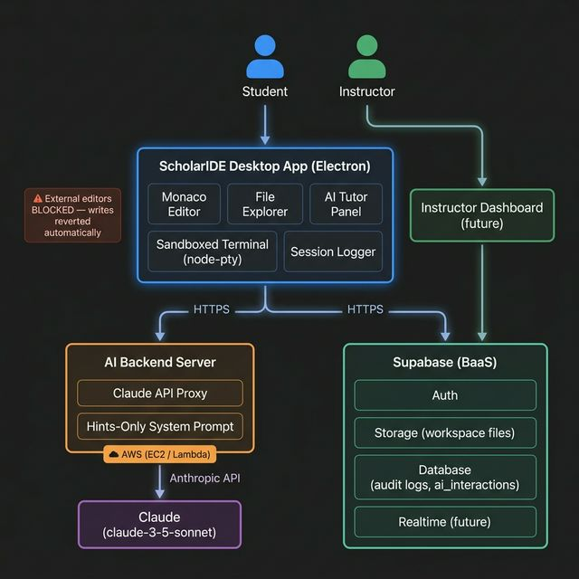

# ScholarIDE — Project Overview

## What is ScholarIDE?

ScholarIDE is a **sandboxed, integrity-first code editor** built as a desktop application using Electron. Its core purpose is to **prevent students from using unauthorized AI tools** (ChatGPT, GitHub Copilot, external editors, etc.) during coding assignments — while still providing a genuinely good IDE experience with a controlled, instructor-approved AI tutor built in.

Students write all their code inside ScholarIDE. The workspace is cryptographically guarded: any file edits made by external programs (VS Code, vim, a terminal outside the app) are automatically detected and reverted. All work is saved to the student's cloud account via Supabase, giving instructors a verifiable record of what was written and when.

The AI Tutor is powered by a **dedicated backend server** that proxies Claude's API with a strict system prompt — it can only give hints and nudges, never complete answers or written code. Students get the benefit of AI assistance without the ability to just ask for solutions.

### Core Value Proposition

> **For instructors:** Know that student code was actually written by the student, inside a controlled environment, with no unauthorized AI assistance.
>
> **For students:** A familiar VS Code-like experience with a built-in AI tutor that teaches through guidance — not code handouts.

---

### Key Features

| Feature | Status |
|---------|--------|
| Monaco Editor (VS Code engine) | ✅ Built |
| File Explorer (tree view) | ✅ Built |
| Sandboxed terminal (zsh/powershell) | ✅ Built |
| External edit detection & revert | ✅ Built |
| Built-in AI Tutor panel | ✅ Built |
| Supabase Authentication | ✅ Built |
| Cloud file storage (workspace sync) | ✅ Built |
| Dedicated AI backend (Claude API) | 🔜 Planned |
| Hints-only system prompt enforcement | 🔜 Planned |
| Session / audit logging | 🔜 Planned |
| Instructor dashboard | 🔜 Planned |
| Assignment management | 🔜 Planned |
| Real-time session monitoring | 🔜 Planned |
| AI usage audit trail | 🔜 Planned |

---

## System Design



### How the Sandbox Works

The main process runs a **File Watcher + Snapshot Guard** that:
1. Takes an MD5 hash snapshot of every file in the workspace on startup
2. Watches for any filesystem change events
3. If a change was NOT triggered internally by ScholarIDE → it is immediately reverted and the student is alerted
4. The terminal is sandboxed to the workspace directory — `cd` outside it is blocked

## ERD — Data the Project Uses

```
┌─────────────────────────────────┐   ┌─────────────────────────────────┐
│    Supabase Auth (users)        │   │   Supabase Storage              │
│─────────────────────────────────│   │─────────────────────────────────│
│ id (uuid)                       │   │ workspaces/                     │
│ email                           │   │   {user_id}/                    │
│ created_at                      │   │     welcome.md                  │
│ last_sign_in_at                 │   │     project/                    │
└─────────────────────────────────┘   │       main.py                   │
         │                            └─────────────────────────────────┘
         │ (future)
         ▼
┌─────────────────────────────────┐
│   audit_logs (Supabase DB)      │   ← PLANNED
│─────────────────────────────────│
│ id                              │
│ user_id → auth.users            │
│ file_path                       │
│ event_type (open/save/run/ai)   │
│ content_snapshot                │
│ timestamp                       │
└─────────────────────────────────┘
         │
         │ belongs to
         ▼
┌─────────────────────────────────┐
│   assignments (Supabase DB)     │   ← PLANNED
│─────────────────────────────────│
│ id                              │
│ instructor_id → auth.users      │
│ title                           │
│ description                     │
│ due_at                          │
│ ai_tutor_allowed (bool)         │
│                                 │
└─────────────────────────────────┘
         │
         │ referenced by
         ▼
┌─────────────────────────────────┐
│  ai_interactions (Supabase DB)  │   ← PLANNED
│─────────────────────────────────│
│ id                              │
│ user_id → auth.users            │
│ assignment_id → assignments     │
│ role (user / assistant)         │
│ content (text)                  │
│ timestamp                       │
└─────────────────────────────────┘
```

---

## Future Plans

### 1. Dedicated AI Backend (Claude API)
Replace the local dev server with a production backend (Node.js/Express or similar) that:
- Authenticates every request via Supabase JWT
- Enforces a **hints-only system prompt** — Claude is instructed never to write code for the student
- Supports per-assignment system prompt overrides set by the instructor
- Logs every interaction to the `ai_interactions` table
- Rate-limits students to prevent flooding the API

### 2. Audit Logging
Every meaningful event (file save, AI query, terminal command, file run, integrity violation) written to `audit_logs` with a timestamp and content snapshot. Instructors can replay a student's full coding session chronologically.

### 3. Instructor Dashboard (web app)
A separate Next.js web app where instructors can:
- Create and distribute coding assignments
- View all student submissions and workspace snapshots
- Browse audit logs and session replays
- Read full AI tutor conversation history per student
- Configure per-assignment rules (AI disabled, custom system prompt, due date)

### 4. Real-Time Monitoring (Supabase Realtime)
Live view of active student sessions during exams — instructors see which files are open, last save time, and any integrity violations in real time.

### 5. Assignment Distribution
Instructors create assignments with starter files → distributed to student workspaces via Supabase Storage. Students open an assignment and their workspace is pre-populated.

### 6. AI Usage Audit
Full AI tutor logs stored in `ai_interactions`. Instructors can see every question a student asked and every hint Claude gave — making it easy to spot if a student tried to extract answers by rephrasing.

---

## Daily Goals

| Date | Goal |
|------|------|
| Feb 10, 2026 | ✅ Initial setup — text editor, file explorer, terminal |
| Feb 11, 2026 | ✅ App builds and opens files; terminal cwd tracking; block external edits |
| Feb 12, 2026 | ✅ Workspace-only IDE; clean terminal; AI agent panel; AI tutor working |
| Mar 30, 2026 | ✅ Agent fixes; Supabase auth + file storage integrated |
| Mar 31 | Build dedicated AI backend server skeleton (Express + Claude API) |
| Apr 1 | Implement hints-only system prompt + JWT auth on backend |
| Apr 2 | Add `ai_interactions` logging to DB; add audit_logs for file saves |
| Apr 3 | Add multi-tab editor + git status indicators in file explorer |
| Apr 6 | Build instructor dashboard (Next.js) — auth, student list, AI log viewer |
| Apr 7 | Instructor dashboard — audit log viewer / session replay |
| Apr 8 | Assignment system — create, assign, distribute starter files |
| Apr 9 | Polish UI + write README + record demo |
| Apr 10 | **Final presentation / submission** |

---

## Cost Estimates

### Model: `claude-haiku-4-5`

Haiku is used instead of Sonnet because tutoring hints are short, focused responses — Haiku handles these well and is **3–5× cheaper**.

| Model | Input / 1M tokens | Output / 1M tokens |
|-------|------------------|-------------------|
| claude-haiku-4-5 | $1.00 | $5.00 |

### Monthly Cost — 30 Students

> 30 students × 10 sessions × 20 queries = **6,000 queries/month**

| Service | Monthly Cost |
|---------|-------------|
| Anthropic (`claude-haiku-4-5`) | $10.80 |
| AWS Lambda + API Gateway | $1.50 |
| Supabase Pro | $25.00 |
| **Total** | **~$37.30/month** |
| **Per student** | **~$1.24/month** |

### Supabase Tier Breakdown

| Resource | Pro Includes | ScholarIDE @ 2,000 students | Overage cost | Overage? |
|----------|-------------|----------------------------|-------------|----------|
| MAU | 100,000 | 2,000 | $0.00325/MAU | ✅ $0 |
| File storage | 100 GB | ~10 GB (2k × 5 MB workspaces) | $0.021/GB | ✅ $0 |
| DB disk | 8 GB | ~3 GB (audit logs + AI rows) | $0.125/GB | ✅ $0 |
| Egress | 250 GB | ~10 GB (workspace restores) | $0.09/GB | ✅ $0 |
| Cached egress | 250 GB | minimal | $0.03/GB | ✅ $0 |

> **All realistic ScholarIDE workloads fit comfortably inside Supabase Pro's included limits up to 2,000+ students.** The $600/month Team tier is only relevant for institutional features (SSO, multi-org management, compliance) — not for capacity.

### Scaling Projections

| Students | Anthropic | AWS | Supabase | Total/mo | Per Student |
|----------|-----------|-----|----------|----------|-------------|
| 30 | $10.80 | $1.50 | $25 (Pro) | **~$37** | **~$1.24** |
| 150 | $54 | $7 | $25 (Pro) | **~$86** | **~$0.57** |
| 500 | $180 | $22 | $25 (Pro) | **~$227** | **~$0.45** |
| 2,000 | $720 | $85 | $25 (Pro) | **~$830** | **~$0.42** |
| **100,000** | **$36,000** | **$574** | **$611 (Team)** | **~$37,185** | **~$0.37** |

> Supabase stays at $25 (Pro) up to ~2,000 students because ScholarIDE's data is text-only and tiny. Team ($599) only becomes relevant at institutional scale or for compliance features (SOC2, SSO, HIPAA).

---
### Cost Mitigation at Scale

| Strategy | Impact |
|----------|--------|
| Cap queries at 10/session (half current assumption) | Cuts Anthropic bill to **~$18,000/mo** |
| Cap queries at 5/session | Cuts to **~$9,000/mo** |
| Cache common conceptual answers (e.g. "what is a loop?") | ~10–20% reduction |
| Negotiate Anthropic volume pricing at this scale | Custom pricing available |
| Shorten system prompt by 100 tokens | Saves $2,000/mo at 100K MAU |


---

## Scaling Bottlenecks

| System | Bottleneck | 
|--------|-----------|
| **Anthropic API** | Rate limits hit when 30+ students query simultaneously during exams | 
| **Supabase Storage** | Burst of concurrent file uploads when all students save at once | 
| **Supabase Realtime** | Free tier caps at 200 concurrent WebSocket connections | 
| **Database growth** | `audit_logs` and `ai_interactions` grow unboundedly with usage | 
| **Electron distribution** | Every student needs a platform-specific app | 

---

## Durability

| System | Durability |
|--------|-----------|
| **Supabase Storage** | S3-backed — 99.999999999% object durability | 
| **Supabase Database** | Managed Postgres with daily snapshots | 
| **AWS AI Backend** | Stateless — no data lives on the server | 
| **Local workspace** | Stored in Electron `userData` dir | 
| **Auth tokens** | Supabase JWTs cached locally; valid for up to 1hr | 

If a student loses network during an exam, file saves accumulate locally but never reach the cloud.
---

## Recoverability

| Failure Scenario | Recovery Steps | 
|-----------------|---------------|
| **Student's machine dies** | Log in on any new machine → workspace auto-downloads from Supabase Storage |
| **AWS AI backend down** | IDE remains fully usable; AI Tutor shows error. Lambda auto-recovers instantly; EC2 restarts in ~3–5 min |
| **Supabase outage** | Students coast on cached auth tokens (up to 1hr); saves queue locally | 
| **DB corruption / bad deploy** | Supabase Point in Time Recovery (Pro): restore to any point in last 7 days | 
| **File accidentally deleted** | Restore from Supabase Storage version history or DB snapshot | 
